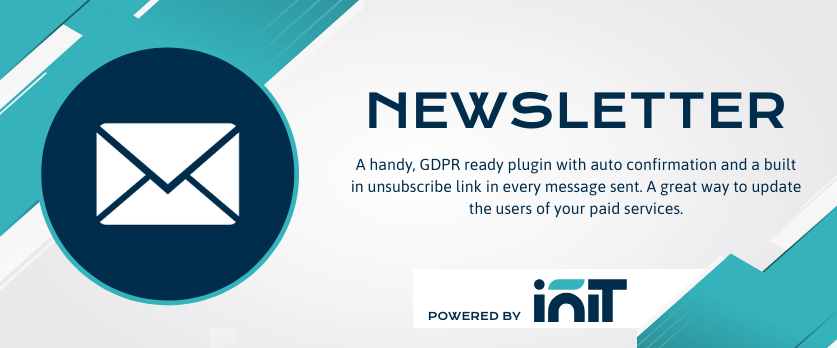

Newsletter plugin
===

## Introduction

Send branded newsletter e-mails to subscribers.  Easy to use and fully GDPR compliant this clever plugin gives you a number of options to offer prospective subscribers.

1. Simple checkbox management for opting in subscribers to all or selected lists.
1. Automatic email verification to confirm opt in.
1. Visitor managed message categories if required.
1. Admin choice for sending to all or selected lists.
1. Messages can be created and saved for future broadcast.
1. Unsubscribe link in every message sent.

### Usage
1. Create page for managing newsletter options by subscribers so that it has `:email` and `:token` variables (for example `manage-newsletter` with `/manage-newsletter/:email/:token` URL). Of course, those variables can be changed.
1. Embed component `NewsletterConfirm` on exact one CMS page (Newsletter plugin will automatically look for a page that has the component and cache it for 10 minutes)
1. Go to backend Newsletter -> Checkboxes and add checkboxes as your business requires
1. Embed component `NewsletterForm` on the page you want to have form rendered on (landing page or just footer partial)

> Do not forget to configure e-mail sending in your backend settings

### Translations
The plugin supports translations for all elements (there are no hardcoded frontend contents) including AJAX responses and displayed errors.

Out of the box, there are only two languages:
* pl - Polski
* en - English

But of course, you can prepare your own translations.

### E-mail templates
Out of the box, there are two e-mail templates you can to customize:

* `inibiz.newsletter::mail.subscription` which is sent to those who want to become a subscriber
* `initbiz.newsletter::mail.message` which is sent to subscribers

In `subscription` e-mail template you can use `{{activationLink}}` variable.

In `message` e-mail template you can use:
* `{{title}}` - Title of message
* `{{content}}` - Content of message
* `{{ newsletterLink }}` - link for subscribers to sign out from newsletter

If you want, you can create your own e-mail template. While sending you just have to choose which one you want to use. The `message` e-mail template is just a default one.
